# Documentación técnica — UrbanStyle AWS

## 1. Introducción

UrbanStyle es una empresa ficticia de venta online de ropa, calzado y complementos. Este proyecto diseña e implementa una arquitectura en **Amazon Web Services (AWS)** para alojar una tienda basada en **WordPress**, con orientación a disponibilidad, escalabilidad y seguridad.

### Componentes principales

**Implementados en el laboratorio**

- Amazon VPC (multi-AZ)
- Subredes públicas y privadas
- Internet Gateway y tablas de rutas
- Launch Template + EC2 Auto Scaling
- Application Load Balancer + Target Group
- Amazon RDS MySQL + DB Subnet Group
- Security Groups (ALB / EC2 / RDS)
- WordPress operativo

**Contemplados en el diseño (no desplegados en el lab)**

- Amazon Route 53
- AWS Certificate Manager (ACM)
- AWS WAF
- Amazon CloudWatch
- AWS Backup
- AWS IAM (de la solución)
- Amazon S3 (medios de la tienda)

### Dónde está cada cosa

| Contenido | Ubicación |
| --- | --- |
| README | `README.md` |
| Documentación completa | `documentation/` |
| Diagramas | `diagrams/` |
| Evidencias | `screenshots/` |

---

## 2. Descripción del problema

Con el crecimiento del tráfico y las campañas comerciales (rebajas, Black Friday, Navidad), un hosting tradicional (aplicación y base de datos en el mismo servidor) presenta:

- Falta de escalabilidad ante picos de demanda
- Baja disponibilidad ante fallos de un único servidor
- Seguridad y recuperación limitadas
- Poca flexibilidad para crecer sin rediseñar el alojamiento

**Problema a resolver:** migrar a una arquitectura AWS que mejore disponibilidad, escalabilidad y seguridad, manteniendo WordPress como aplicación.

---

## 3. Casos de uso

Formato: **Rol / Acción / Resultado esperado**.

### UC-01 — Cliente consulta el catálogo

| Campo | Detalle |
| --- | --- |
| Rol | Cliente (navegador / móvil) |
| Acción | Acceder a la tienda y navegar productos |
| Resultado esperado | La petición llega al ALB, se enruta a una EC2 `Healthy` y la página responde |

### UC-02 — Cliente realiza un pedido

| Campo | Detalle |
| --- | --- |
| Rol | Cliente |
| Acción | Completar una compra en la tienda |
| Resultado esperado | La aplicación persiste pedido y datos en RDS |

> En el laboratorio actual la evidencia de aplicación muestra WordPress operativo. WooCommerce forma parte del alcance funcional de diseño; si se quiere demostrar e-commerce completo, conviene añadir evidencia específica del plugin.

### UC-03 — Administrador gestiona la tienda

| Campo | Detalle |
| --- | --- |
| Rol | Administrador WordPress |
| Acción | Gestionar contenido, productos y pedidos desde el panel |
| Resultado esperado | Acceso al backend sobre la misma infraestructura (ALB -> EC2 -> RDS) |

### UC-04 — Pico de tráfico

| Campo | Detalle |
| --- | --- |
| Rol | Auto Scaling / demanda de usuarios |
| Acción | Aumento de carga (CPU) |
| Resultado esperado | El ASG escala entre el mínimo y el máximo configurados (min/desired 2, max 4, CPU 50%) |

### UC-05 — Fallo de instancia

| Campo | Detalle |
| --- | --- |
| Rol | Infraestructura |
| Acción | Una instancia deja de pasar health checks |
| Resultado esperado | El Target Group deja de enviarle tráfico; el ASG puede reemplazar capacidad. Hay instancias en dos AZs |

---

## 4. Solución

La solución se presenta en dos niveles:

1. **Arquitectura objetivo (diseño):** incluye servicios de DNS, TLS, WAF, monitorización, backup e IAM.
2. **Arquitectura de laboratorio (implementada):** VPC, ALB, ASG, RDS, Security Groups y WordPress, con evidencias en `screenshots/`.

### Inventario implementado

| Componente | Detalle | Evidencia |
| --- | --- | --- |
| VPC | `UrbanStyle-vpc`, CIDR `10.0.0.0/16`, `us-east-1` | `vpc-overview.png`, `vpc-details.png` |
| Subredes | 2 públicas + 2 privadas en `us-east-1a` / `us-east-1b` | `vpc-overview.png`, `rds-subnet-groups.png` |
| Networking | IGW + route tables | `vpc-networking.png` |
| Launch Template | `urbanstyle-launch-template` | `launch-template.png` |
| Auto Scaling | `urbanstyle-asg` (min/desired 2, max 4, CPU 50%) | `autoscaling-capacity.png` |
| ALB | `Urbanstyle-alb`, internet-facing | `load-balancer.png` |
| Target Group | HTTP:80, 2 instancias `Healthy` | `target-group-healthy-instances.png` |
| RDS | MySQL `db.t3.micro` | `rds-database.png` |
| Security Groups | ALB / EC2 / RDS | `segurity-groups-alb.png`, `security-groups-ec2.png`, `security-groups-rds.png` |
| Aplicación | WordPress UrbanStyle | `wordpress_urbanstyle_funcionando.png` |

---

## 5. Arquitectura

### 5.1 Vista cliente

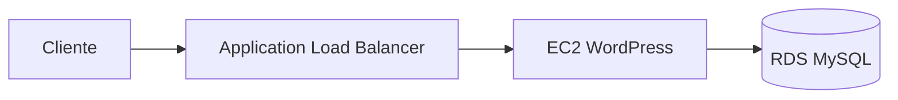

### 5.2 Vista administrador

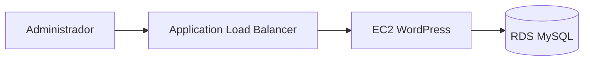

Ambas vistas comparten la base de datos; el caso de uso es distinto.

### 5.3 Diagrama lógico del repositorio

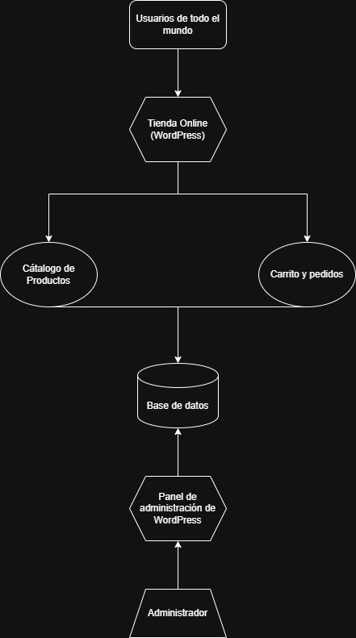

### 5.4 Diagrama de arquitectura AWS

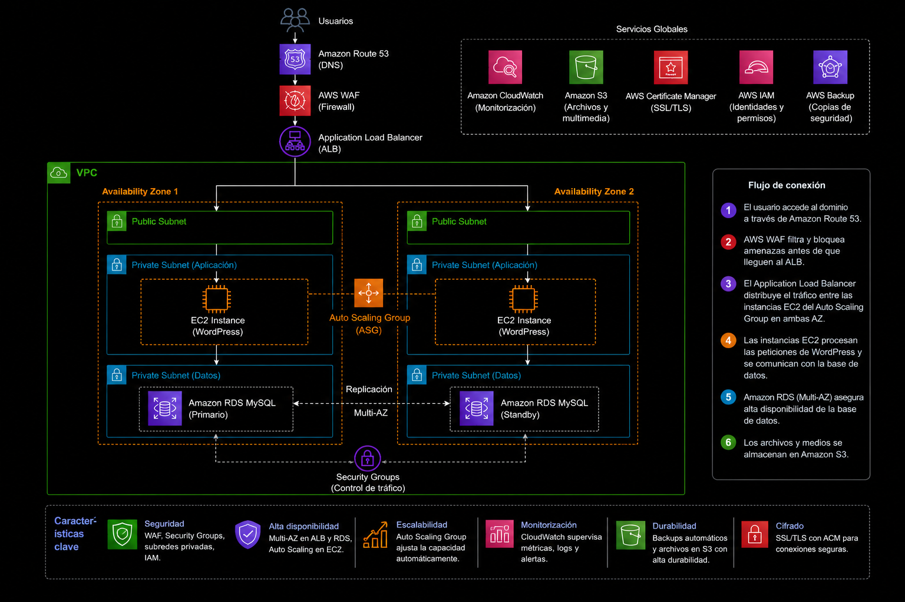

**Cómo leer el diagrama:** los servicios del núcleo (VPC, ALB, ASG, RDS, SG, WordPress) están evidenciados en el laboratorio. Route 53, ACM, WAF, CloudWatch, Backup, IAM y S3 pertenecen al diseño objetivo.

### 5.5 Flujo de una petición en el lab

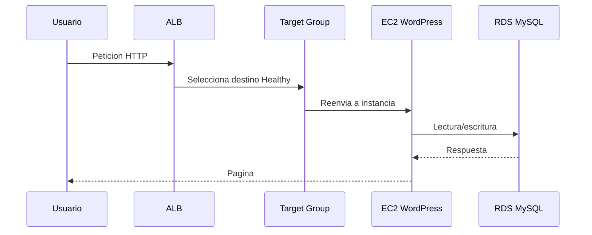

---

## 6. Implementación con evidencias

### 6.1 VPC y red

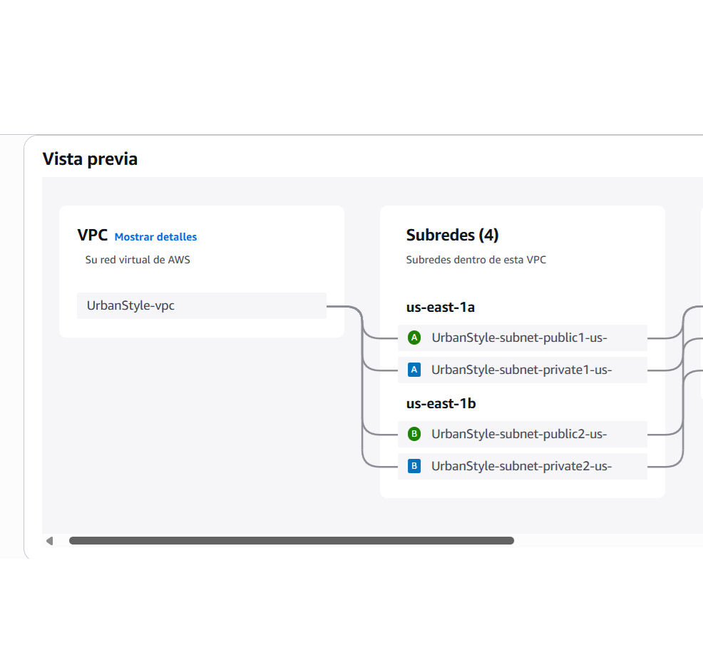

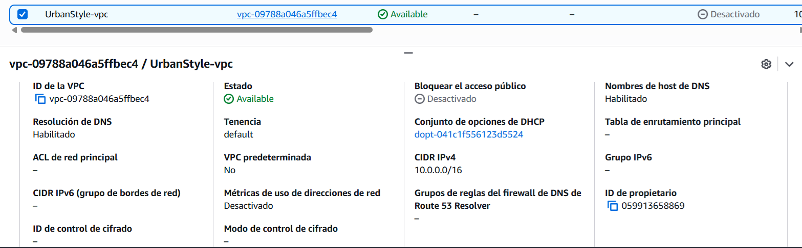

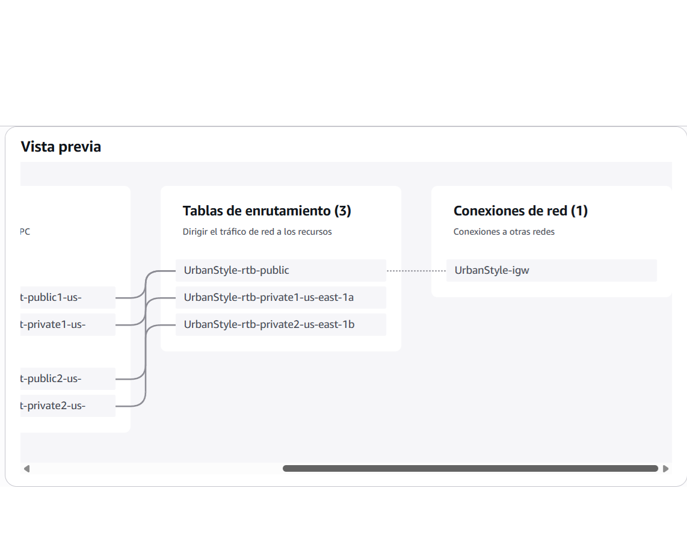

### 6.2 Launch Template y Auto Scaling

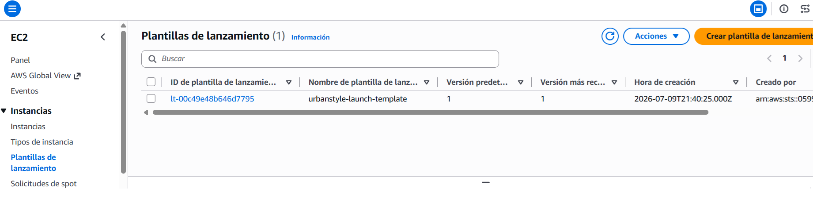

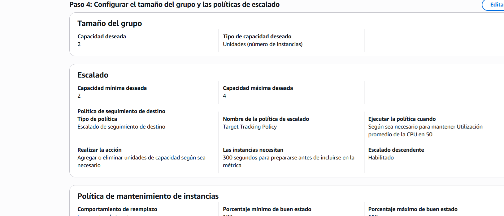

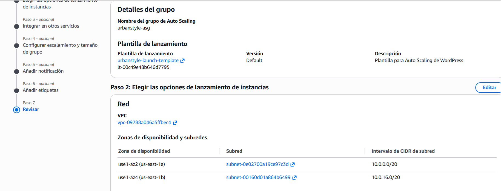

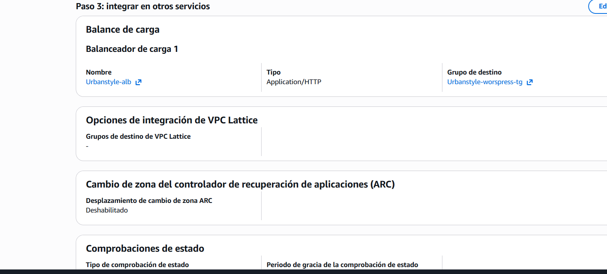

### 6.3 Load Balancer y Target Group

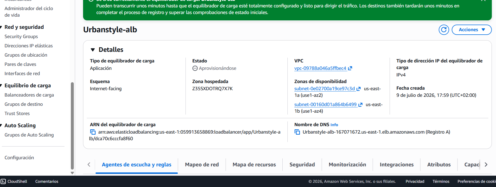

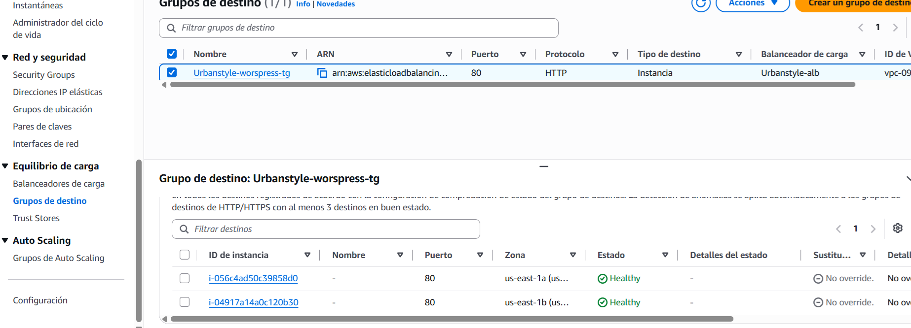

### 6.4 Base de datos RDS

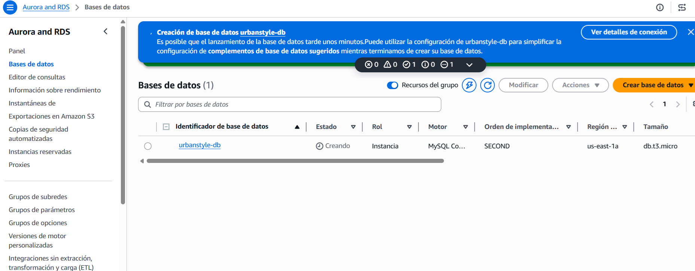

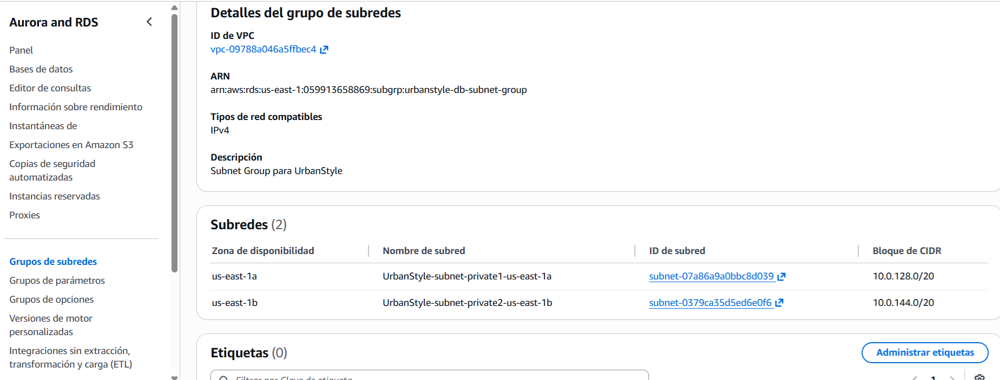

### 6.5 Security Groups

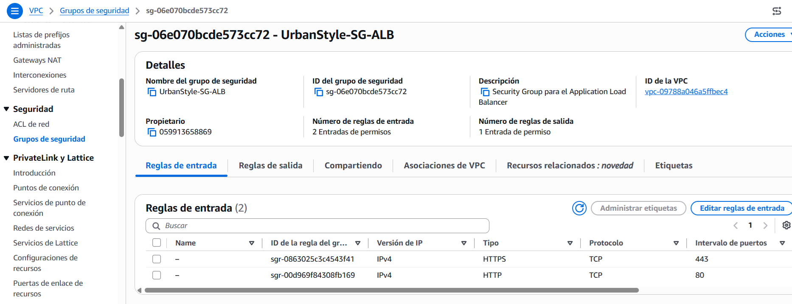

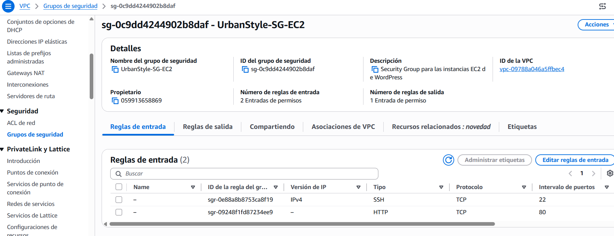

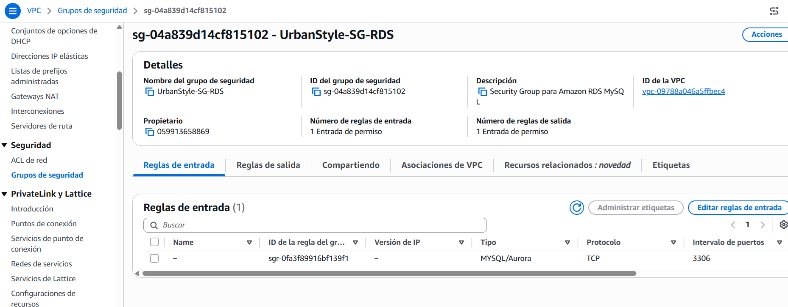

### 6.6 Aplicación

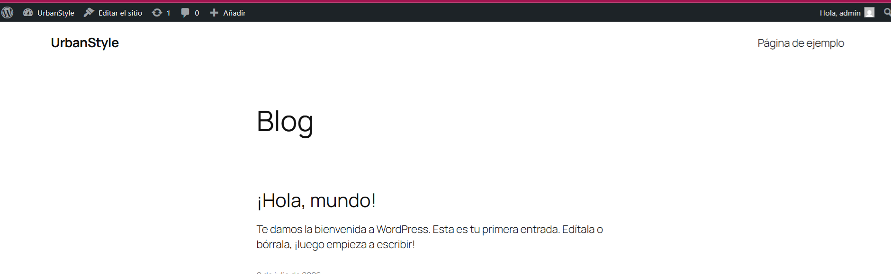

---

## 7. Alta disponibilidad, escalabilidad y seguridad

**Disponibilidad:** 2 AZs, ALB + health checks, ASG con mínimo 2 instancias.

**Escalabilidad:** ASG min 2 / max 4, tracking CPU 50%, Launch Template.

**Seguridad (lab):** Security Groups por capas y RDS en subnet group privado.

**Seguridad (diseño):** WAF, ACM/HTTPS, IAM fino, Backup y CloudWatch.

---

## 8. Limitaciones del laboratorio

Por restricciones del entorno académico/lab, no se desplegaron: Route 53, ACM, WAF, CloudWatch, Backup, IAM de la solución y S3 de medios.

Además, en el laboratorio la capa de aplicación se evidenció sobre subredes alineadas con el ALB internet-facing (sin NAT demostrado). El diseño objetivo sitúa EC2 en privadas con salida controlada. Conviene explicitar esta diferencia al presentar el diagrama.

---

## 9. Conclusiones

Este proyecto permite demostrar, con evidencias, el diseño e implementación de una arquitectura AWS multi-AZ para una aplicación WordPress:

- networking con VPC y segmentación por capas
- balanceo de carga con Application Load Balancer y Target Group
- escalado horizontal con Auto Scaling y Launch Template
- base de datos gestionada con Amazon RDS
- control de tráfico con Security Groups

La documentación distingue de forma explícita lo implementado en el laboratorio frente a los servicios contemplados solo en el diseño (Route 53, ACM, WAF, CloudWatch, Backup, IAM y S3). Esa separación deja claro el alcance real del trabajo y facilita entender qué parte de la arquitectura está validada con capturas.
